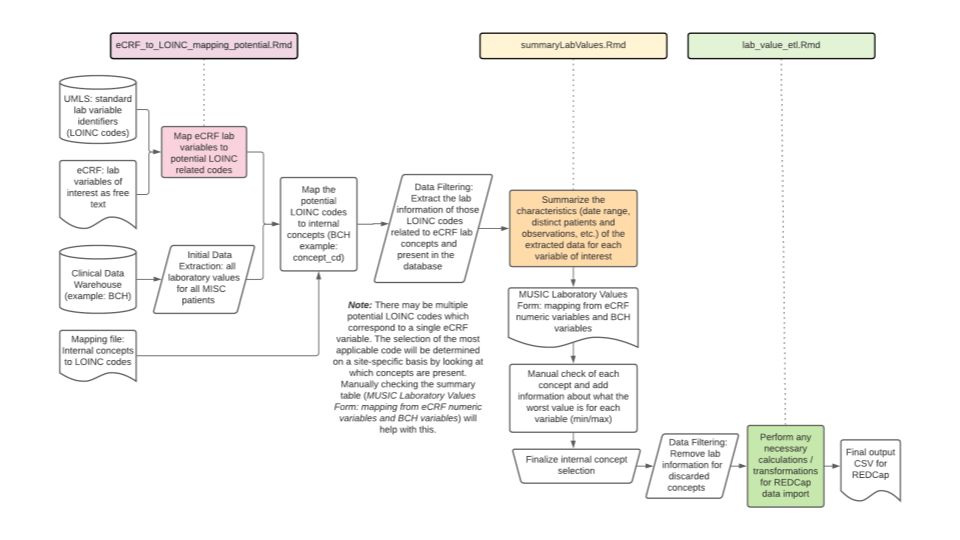

Reorganization: separate directory per eCRF
# music-ecrf-harmonization

This repository contains:

- **R**
  - `eCRF_to_LOINC_mapping_potential.Rmd` : Create list of potential LOINC terms from eCRF variable text. Check the prevalence of the LOINC terms in site-specific mappings and patient data.
  - `summaryLabValues.Rmd` : Once a list of site-specific codes is obtained to query, create a summary table of lab variables for evaluation.
  - `exploringMapping.Rmd` : Check consistency of data units and ranges between BCH and eCRFs
  - `data_dictionary_extraction.Rmd`: Extract metadata from variables specific to the laboratory_values form to determine which variables to use in first iteration of MUSIC ETL
  - `lab_value_etl.Rmd`: Use identified variables from `data_dictionary_extraction.Rmd` to query database and reformat results to satisfy RedCap specifications
  - `music_lab_values.R` : Initial code for extracting internal and external tables

- **data**

  *No patient-level data is ever uploaded*
  - `MUSIC_DataDictionary_V3_4Dec20_final version_clean_0.csv` : Original data dictionary from HealthCore
  - `BCH_Lab_Loinc_cd_Map.data.csv` : Mapping from LOINC codes to internal BCH concepts.
  - `lab_keywords.tsv` : List of manually curated keywords for querying UMLS LOINC codes for eCRF variables.
  - `eCRF_to_LOINC_forReview.csv` : List of potential LOINC codes for clinician review.
  - `eCRF to BCH mapping.csv` : Mapping of eCRF variable names to BCH concepts (initial work from Sajad)
  - `labDictionary.txt` : subset of variables for testing

- **local_ref**

  *This directory is not tracked by GitHub; it contains patient-level data intermediates and outputs. Some scripts may reference it, you may want to create a corresponding directory in your local copy of the repository.*
  - `connection.R` : Connection to BCH database
  - `testoutput.csv` : Data extracted from BCH database
  - `lab_bch.dsv` : Data extracted from BCH database (?)
  - `patient_timeline.csv`
