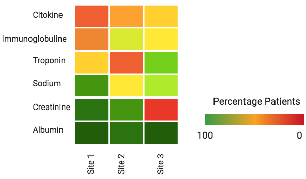

## Load the R libraries
```{r}
library( dplyr )
library( tidyr )
library( ggplot2 )
library( tidyverse )
```


## Input file

The input file for this heatmap is the summary information per site and laboratory value. This file contains, for each laboratory variable, how many patients have at least one time this lab value ordered. 

```{r input}
input <- read.delim("MUSIC Laboratory Values Form_ mapping from eCRF numeric variables and BCH variables - eCRF to BCH laboratory numeric variables.tsv", header = TRUE, skip =1)
```

We select the columns of interest, replace the na values for 0, estimate the percentage of patients, given that we have the total number of patients in the site, and add the site identifier, so we can expand the plot to summary the information accross multiple sites. 

```{r}
totalPatients <- 47
input <- unique( input %>%
  dplyr::filter( Section.Header != "") %>%
  dplyr::mutate( percentage_patients = replace_na( round(100*distinct_patients/totalPatients, 2), 0), site = "BCH" ) %>%
  dplyr::select( formName, Section.Header, distinct_patients, percentage_patients, site) %>%
  dplyr::arrange( desc( percentage_patients ) ) )
```

We sort the data from the highest percentage to the lowest. 
```{r}
input$sort_var <- factor(input$Section.Header, 
                         levels = rev(input$Section.Header[order(input$percentage_patients, na.last = TRUE, decreasing = TRUE)]))

```

## Generate the heatmap

We will generate a heatmap that will contain for each row a laboratory value and each column a different site. The cells will be colored according to the percentage of patients value. 



```{r heatmap, echo=FALSE}
ggplot( data=input, aes(x = site, y= sort_var, fill= percentage_patients,width=3)) + 
  ggplot2::geom_tile( ) +
  ggplot2::scale_fill_gradient2(low="#FF9999", mid="#FFFF99", high="#00CC66", 
                       midpoint=50,    
                       breaks=seq(0,50,100), 
                       limits=c(0,100)) +
  ggplot2::theme_bw() +
  ggplot2::coord_equal() +
  ggplot2::xlab("")+
  ggplot2::ylab("")+
  geom_text(aes(label = paste0(round(percentage_patients, 1), "%")), size = 1) +
  ggplot2::theme(axis.text.x = ggplot2::element_text(angle = 0, hjust = 1),
                 panel.grid = element_blank(),
                 text = ggplot2::element_text(size = 6),
                 axis.title = ggplot2::element_text(size = 7))
```

